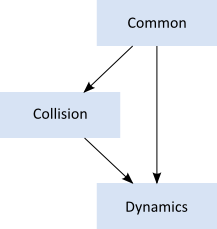

# Introduction

[About](#about) 
[Prerequisites](#pre) 
[About this manual](#atm) 
[Feedback and reporting bugs](#frb) 
[Core concepts](#cc) 
[Modules](#mo) 
[Units](#un) 
[Factories and definitions](#fd) 

 

## About

LiquidFun is based on Erin Catto's [Box2D library](http://www.box2d.org), which
provides 2D, rigid-body simulation in games. LiquidFun extends Box2D to provide
[particle physics and fluid dynamics](md__chapter11__particles.html).

Programmers can use LiquidFun in their games to make objects move in realistic
ways and make the game world more interactive. From the game engine's point of
view, a physics engine is just a system for procedural animation.

LiquidFun is written in portable C++. Most of the types defined in the engine
begin with the b2 prefix. Hopefully this is sufficient to avoid name clashing
with your game engine.

 
## Prerequisites

In this manual I'll assume you are familiar with basic physics concepts, such
as mass, force, torque, and impulses. If not, please first consult Google
search and Wikipedia.

LiquidFun is based on the Box2D library, which was created as part of a
physics tutorial at the Game Developer Conference. You can get these tutorials
from the download section of Box2D.org.

Since LiquidFun is written in C++, you are expected to be experienced in C++
programming. LiquidFun should not be your first C++ programming project! You
should be comfortable with compiling, linking, and debugging.

	Caution
	
	LiquidFun should not be your first C++ project. Please learn C++
programming, compiling, linking, and debugging before working with LiquidFun.
There are many resources for this on the net.

 

## About this manual

This manual covers the majority of the LiquidFun API. However, not every
aspect is covered. You are encouraged to look at the testbed included with
LiquidFun to learn more. Also, the LiquidFun code base has comments formatted
for Doxygen, so it is easy to create a hyper-linked API document.

This manual is only updated with new releases. The version in source control
is likely to be out of date.

 
## Feedback and Reporting Bugs

If you have a question or feedback about LiquidFun, please leave a comment in
the forum. This is also a great place for community discussion.

LiquidFun issues are tracked using a Google code project. This is a great way
to track issues and ensures that your issue will not be lost in the depths of
the forums.

Please file bugs and feature requests here:
[http://github.com/google/liquidfun/issues](http://github.com/google/liquidfun/issues)

 You can help to ensure your issue gets fixed if you provide sufficient
detail. A testbed example that reproduces the problem is ideal. You can read
about the testbed later in this document.

 
## Core Concepts

LiquidFun works with several fundamental concepts and objects. We briefly
define these objects here and more details are given later in this
document. 
 
### shape
A shape is 2D geometrical object, such as a circle or polygon. 

### rigid body
A chunk of matter that is so strong that the distance between any two bits of
matter on the chunk is constant. They are hard like a diamond. In the
following discussion we use body interchangeably with rigid body. 

### fixture
A fixture binds a shape to a body and adds material properties such as
density, friction, and restitution. A fixture puts a shape into the collision
system (broad-phase) so that it can collide with other shapes. 

### constraint
A constraint is a physical connection that removes degrees of freedom from
bodies. A 2D body has 3 degrees of freedom (two translation coordinates and
one rotation coordinate). If we take a body and pin it to the wall (like a
pendulum) we have constrained the body to the wall. At this point the body can
only rotate about the pin, so the constraint has removed 2 degrees of
freedom. 

### contact constraint
A special constraint designed to prevent penetration of rigid bodies and to
simulate friction and restitution. You do not create contact constraints; they
are created automatically by LiquidFun. 

### joint
This is a constraint used to hold two or more bodies together. LiquidFun
supports several joint types: revolute, prismatic, distance, and more. Some
joints may have limits and motors. 

### joint limit
A joint limit restricts the range of motion of a joint. For example, the human
elbow only allows a certain range of angles. 

### joint motor
A joint motor drives the motion of the connected bodies according to the
joint's degrees of freedom. For example, you can use a motor to drive the
rotation of an elbow. 

### world

A physics world is a collection of bodies, fixtures, and constraints that
interact together. LiquidFun supports the creation of multiple worlds, but
this is usually not necessary or desirable. 

### solver
The physics world has a solver that is used to advance time and to resolve
contact and joint constraints. The LiquidFun solver is a high performance
iterative solver that operates in order N time, where N is the number of
constraints. 

### continuous collision
The solver advances bodies in time using discrete time steps. Without
intervention this can lead to tunneling. 
 

 

LiquidFun contains specialized algorithms to deal with tunneling. First, the
collision algorithms can interpolate the motion of two bodies to find the
first time of impact (TOI). Second, there is a sub-stepping solver that moves
bodies to their first time of impact and then resolves the collision.

 
## Modules

LiquidFun is composed of three modules: Common, Collision, and Dynamics. The
Common module has code for allocation, math, and settings. The Collision
module defines shapes, a broad-phase, and collision functions/queries. Finally
the Dynamics module provides the simulation world, bodies, fixtures, and
joints. 
 

 
## Units

LiquidFun works with floating point numbers and tolerances have to be used to
make LiquidFun perform well. These tolerances have been tuned to work well
with meters-kilogram-second (MKS) units. In particular, LiquidFun has been
tuned to work well with moving shapes between 0.1 and 10 meters. So this means
objects between soup cans and buses in size should work well. Static shapes
may be up to 50 meters long without trouble.

Being a 2D physics engine, it is tempting to use pixels as your units.
Unfortunately this will lead to a poor simulation and possibly weird behavior.
An object of length 200 pixels would be seen by LiquidFun as the size of a 45
story building.

	Caution
	
	LiquidFun is tuned for MKS units. Keep the size of moving objects
roughly between 0.1 and 10 meters. You'll need to use some scaling system when
you render your environment and actors. The LiquidFun testbed does this by
using an OpenGL viewport transform. DO NOT USE PIXELS.

It is best to think of LiquidFun bodies as moving billboards upon which you
attach your artwork. The billboard may move in a unit system of meters, but
you can convert that to pixel coordinates with a simple scaling factor. You
can then use those pixel coordinates to place your sprites, etc. You can also
account for flipped coordinate axes.

LiquidFun uses radians for angles. The body rotation is stored in radians and
may grow unbounded. Consider normalizing the angle of your bodies if the
magnitude of the angle becomes too large (use b2Body::SetAngle).

	Caution
	
	LiquidFun uses radians, not degrees.

 
## Factories and Definitions

Fast memory management plays a central role in the design of the LiquidFun
API. So when you create a b2Body or a b2Joint, you need to call the factory
functions on b2World. You should never try to allocate these types in another
manner.

There are creation functions:

&nbsp;&nbsp;&nbsp;`b2Body* b2World::CreateBody(const b2BodyDef* def)` 
&nbsp;&nbsp;&nbsp;`b2Joint* b2World::CreateJoint(const b2JointDef* def)` 
&nbsp;&nbsp;&nbsp;`And there are corresponding destruction functions:` 
&nbsp;&nbsp;&nbsp;`void b2World::DestroyBody(b2Body* body)` 
&nbsp;&nbsp;&nbsp;`void b2World::DestroyJoint(b2Joint* joint)` 

When you create a body or joint, you need to provide a definition. These
definitions contain all the information needed to build the body or joint. By
using this approach we can prevent construction errors, keep the number of
function parameters small, provide sensible defaults, and reduce the number of
accessors.

Since fixtures (shapes) must be parented to a body, they are created and
destroyed using a factory method on b2Body:

&nbsp;&nbsp;&nbsp;`b2Fixture* b2Body::CreateFixture(const b2FixtureDef*
def)` 
&nbsp;&nbsp;&nbsp;`void b2Body::DestroyFixture(b2Fixture* fixture)` 

There is also shortcut to create a fixture directly from the shape and density.

&nbsp;&nbsp;&nbsp;`b2Fixture* b2Body::CreateFixture(const b2Shape* shape,
float32 density)` 

Factories do not retain references to the definitions. So you can create
definitions on the stack and keep them in temporary resources.

*This content is licensed under
[Creative Commons Attribution 4.0](http://creativecommons.org/licenses/by/4.0/legalcode).
For details and restrictions, please see the
[Content License](md__content_license.html).*

[ ][Chapter02]
[ ][Chapter03]
[ ][Chapter04]
[ ][Chapter05]
[ ][Chapter06]
[ ][Chapter07]
[ ][Chapter08]
[ ][Chapter09]
[ ][Chapter10]
[ ][Chapter11]
[ ][Chapter12]
[ ][Chapter13]
[ ][Chapter14]
[ ][Chapter15]

  [Chapter02]: md__chapter02__hello__box2_d.html
  [Chapter03]: md__chapter03__common.html
  [Chapter04]: md__chapter04__collision__module.html
  [Chapter05]: md__chapter05__dynamics__module.html
  [Chapter06]: md__chapter06__bodies.html
  [Chapter07]: md__chapter07__fixtures.html
  [Chapter08]: md__chapter08__joints.html
  [Chapter09]: md__chapter09__contacts.html
  [Chapter10]: md__chapter10__world.html
  [Chapter11]: md__chapter11__particles.html
  [Chapter12]: md__chapter12__loose__ends.html
  [Chapter13]: md__chapter13__debug__drawing.html
  [Chapter14]: md__chapter14__limitations.html
  [Chapter15]: md__chapter15__references.html

