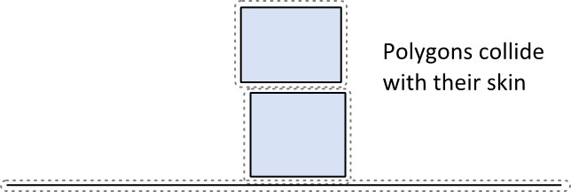
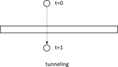

# Collision Module
[About](#about) 
[Shapes](#shapes) 
[Unary Geometric Queries](#un) 
[Binary Functions](#bf) 
[Dynamic Tree](#dt) 
[Broad-Phase](#bp) 

<a name="about">
## About

The Collision module contains shapes and functions that operate on them. The
module also contains a dynamic tree and broad-phase to acceleration collision
processing of large systems.

The collision module is designed to be usable outside of the dynamic system.
For example, you can use the dynamic tree for other aspects of your game
besides physics.

However, the main purpose of LiquidFun is to provide a rigid body physics
engine, so the using the collision module by itself may feel limited for some
applications. Likewise, I will not make a strong effort to document it or
polish the APIs.

<a name="shapes">
## Shapes

Shapes describe collision geometry and may be used independently of physics
simulation. At a minimum, you should understand how to create shapes that can
be later attached to rigid bodies.

LiquidFun shapes implement the b2Shape base class. The base class defines
functions to:

* Test a point for overlap with the shape.

* Perform a ray cast against the shape.

* Compute the shape's AABB.

* Compute the mass properties of the shape.

In addition, each shape has a type member and a radius. The radius even
applies to polygons, as discussed below.

Keep in mind that a shape does not know about bodies and stand apart from the
dynamics system. Shapes are stored in a compact form that is optimized for
size and performance. As such, shapes are not easily moved around. You have to
manually set the shape vertex positions to move a shape. However, when a shape
is attached to a body using a fixture, the shapes move rigidly with the host
body. In summary:

* When a shape is **not** attached to a body, you can view it’s vertices as
being expressed in world-space.

* When a shape is attached to a body, you can view it’s vertices as being
expressed in local coordinates.

### Circle Shapes

Circle shapes have a position and radius.  Circles are solid. You cannot make
a hollow circle using the circle shape.

&nbsp;&nbsp;&nbsp;`b2CircleShape circle;` 
&nbsp;&nbsp;&nbsp;`circle.m_p.Set(2.0f, 3.0f);` 
&nbsp;&nbsp;&nbsp;`circle.m_radius = 0.5f;` 

### Polygon Shapes

Polygon shapes are solid convex polygons. A polygon is convex when all line
segments connecting two points in the interior do not cross any edge of the
polygon. Polygons are solid and never hollow. A polygon must have 3 or more
vertices.

 

Polygon vertices are stored with a counter clockwise winding (CCW). We must be
careful because the notion of CCW is with respect to a right-handed coordinate
system with the z-axis pointing out of the plane. This might turn out to be
clockwise on your screen, depending on your coordinate system conventions.

 

The polygon members are public, but you should use initialization functions to
create a polygon. The initialization functions create normal vectors and
perform validation.

You can create a polygon shape by passing in a vertex array. The maximal size
of the array is controlled by b2_maxPolygonVertices which has a default value
of 8. This is sufficient to describe most convex polygons.

The b2PolygonShape::Set function automatically computes the convex hull and
establishes the proper winding order. This function is fast when the number of
vertices is low. If you increase b2_maxPolygonVertices, then the convex hull
computation might become slow. Also note that the convex hull function may
eliminate and/or re-order the points you provide.

&nbsp;&nbsp;&nbsp;`// This defines a triangle in CCW order.` 
&nbsp;&nbsp;&nbsp;`b2Vec2 vertices[3];` 
&nbsp;&nbsp;&nbsp;`vertices[0].Set(0.0f, 0.0f);` 
&nbsp;&nbsp;&nbsp;`vertices[1].Set(1.0f, 0.0f);` 
&nbsp;&nbsp;&nbsp;`vertices[2].Set(0.0f, 1.0f);` 
&nbsp;&nbsp;&nbsp;`int32 count = 3;` 
&nbsp;&nbsp;&nbsp;`b2PolygonShape polygon;` 
&nbsp;&nbsp;&nbsp;`polygon.Set(vertices, count);` 

The polygon shape has some convenience functions to create boxes.

&nbsp;&nbsp;&nbsp;`void SetAsBox(float32 hx, float32 hy);` 
&nbsp;&nbsp;&nbsp;`void SetAsBox(float32 hx, float32 hy, const b2Vec2& center,
float32 angle);` 

Polygons inherit a radius from b2Shape. The radius creates a skin around the
polygon. The skin is used in stacking scenarios to keep polygons slightly
separated. This allows continuous collision to work against the core polygon.

 
The polygon skin helps prevent tunneling by keeping the polygons separated.
This results in small gaps between the shapes. Your visual representation can
be larger than the polygon to hide any gaps.

 

### Edge Shapes

Edge shapes are line segments. These are provided to assist in making a
free-form static environment for your game. A major limitation of edge shapes
is that they can collide with circles and polygons but not with themselves.
The collision algorithms used by LiquidFun require that at least one of two
colliding shapes have volume. Edge shapes have no volume, so edge-edge
collision is not possible.

&nbsp;&nbsp;&nbsp;`// This an edge shape.` 
&nbsp;&nbsp;&nbsp;`b2Vec2 v1(0.0f, 0.0f);` 
&nbsp;&nbsp;&nbsp;`b2Vec2 v2(1.0f, 0.0f);` 
&nbsp;&nbsp;&nbsp;`b2EdgeShape edge;` 
&nbsp;&nbsp;&nbsp;`edge.Set(v1, v2);` 

In many cases a game environment is constructed by connecting several edge
shapes end-to-end. This can give rise to an unexpected artifact when a polygon
slides along the chain of edges. In the figure below we see a box colliding
with an internal vertex. These *ghost* collisions are caused when the polygon
collides with an internal vertex generating an internal collision normal.

 
If edge1 did not exist this collision would seem fine. With edge1 present, the
internal collision seems like a bug. But normally when LiquidFun collides two
shapes, it views them in isolation.

Fortunately, the edge shape provides a mechanism for eliminating ghost
collisions by storing the adjacent *ghost *vertices. LiquidFun uses these
ghost vertices to prevent internal collisions.

 
&nbsp;&nbsp;&nbsp;`// This is an edge shape with ghost vertices.` 
&nbsp;&nbsp;&nbsp;`b2Vec2 v0(1.7f, 0.0f);` 
&nbsp;&nbsp;&nbsp;`b2Vec2 v1(1.0f, 0.25f);` 
&nbsp;&nbsp;&nbsp;`b2Vec2 v2(0.0f, 0.0f);` 
&nbsp;&nbsp;&nbsp;`b2Vec2 v3(-1.7f, 0.4f);` 
&nbsp;&nbsp;&nbsp;`b2EdgeShape edge;` 
&nbsp;&nbsp;&nbsp;`edge.Set(v1, v2);` 
&nbsp;&nbsp;&nbsp;`edge.m_hasVertex0 = true;` 
&nbsp;&nbsp;&nbsp;`edge.m_hasVertex3 = true;` 
&nbsp;&nbsp;&nbsp;`edge.m_vertex0 = v0;` 
&nbsp;&nbsp;&nbsp;`edge.m_vertex3 = v3;` 

In general stitching edges together this way is a bit wasteful and tedious.
This brings us to chain shapes.

### Chain Shapes

The chain shape provides an efficient way to connect many edges together to
construct your static game worlds. Chain shapes automatically eliminate ghost
collisions and provide two-sided collision.

 
&nbsp;&nbsp;&nbsp;`// This a chain shape with isolated vertices` 
&nbsp;&nbsp;&nbsp;`b2Vec2 vs[4];` 
&nbsp;&nbsp;&nbsp;`vs[0].Set(1.7f, 0.0f);` 
&nbsp;&nbsp;&nbsp;`vs[1].Set(1.0f, 0.25f);` 
&nbsp;&nbsp;&nbsp;`vs[2].Set(0.0f, 0.0f);` 
&nbsp;&nbsp;&nbsp;`vs[3].Set(-1.7f, 0.4f);` 
&nbsp;&nbsp;&nbsp;`b2ChainShape chain;` 
&nbsp;&nbsp;&nbsp;`chain.CreateChain(vs, 4);` 

You may have a scrolling game world and would like to connect several chains
together. You can connect chains together using ghost vertices, like we did
with b2EdgeShape.

&nbsp;&nbsp;&nbsp;`// Install ghost vertices` 
&nbsp;&nbsp;&nbsp;`chain.SetPrevVertex(b2Vec2(3.0f, 1.0f));` 
&nbsp;&nbsp;&nbsp;`chain.SetNextVertex(b2Vec2(-2.0f, 0.0f));` 

You may also create loops automatically.

&nbsp;&nbsp;&nbsp;`// Create a loop. The first and last vertices are
connected.` 
&nbsp;&nbsp;&nbsp;`b2ChainShape chain;` 
&nbsp;&nbsp;&nbsp;`chain.CreateLoop(vs, 4);` 

Self-intersection of chain shapes is not supported. It might work, it might
not. The code that prevents ghost collisions assumes there are no
self-intersections of the chain. Also, very close vertices can cause problems.
Make sure all your edges are longer than b2_linearSlop (5mm).

 
Each edge in the chain is treated as a child shape and can be accessed by
index. When a chain shape is connected to a body, each edge gets its own
bounding box in the broad-phase collision tree.

&nbsp;&nbsp;&nbsp;`// Visit each child edge.` 
&nbsp;&nbsp;&nbsp;`for (int32 i = 0; i < chain.GetChildCount(); ++i)` 
&nbsp;&nbsp;&nbsp;`{` 
&nbsp;&nbsp;&nbsp;&nbsp;&nbsp;&nbsp;`b2EdgeShape edge;` 
&nbsp;&nbsp;&nbsp;&nbsp;&nbsp;&nbsp;`chain.GetChildEdge(&edge, i);` 
&nbsp;&nbsp;&nbsp;&nbsp;&nbsp;&nbsp;`…` 
&nbsp;&nbsp;&nbsp;`}` 

<a name="un">
## Unary Geometric Queries

You can perform a couple of geometric queries on a single shape.

### Shape Point Test

You can test a point for overlap with a shape. You provide a transform for the
shape and a world point.

&nbsp;&nbsp;&nbsp;`b2Transfrom transform;` 
&nbsp;&nbsp;&nbsp;`transform.SetIdentity();` 
&nbsp;&nbsp;&nbsp;`b2Vec2 point(5.0f, 2.0f);` 
&nbsp;&nbsp;&nbsp;`bool hit = shape->TestPoint(transform, point);` 

Edge and chain shapes always return false, even if the chain is a loop.

### Shape Ray Cast

You can cast a ray at a shape to get the point of first intersection and
normal vector. No hit will register if the ray starts inside the shape. A
child index is included for chain shapes because the ray cast will only check
a single edge at a time.

&nbsp;&nbsp;&nbsp;`b2Transfrom transform;` 
&nbsp;&nbsp;&nbsp;`transform.SetIdentity();` 
&nbsp;&nbsp;&nbsp;`b2RayCastInput input;` 
&nbsp;&nbsp;&nbsp;`input.p1.Set(0.0f, 0.0f, 0.0f);` 
&nbsp;&nbsp;&nbsp;`input.p2.Set(1.0f, 0.0f, 0.0f);` 
&nbsp;&nbsp;&nbsp;`input.maxFraction = 1.0f;` 
&nbsp;&nbsp;&nbsp;`int32 childIndex = 0;` 
&nbsp;&nbsp;&nbsp;`b2RayCastOutput output;` 
&nbsp;&nbsp;&nbsp;`bool hit = shape->RayCast(&output, input, transform,
childIndex);` 
&nbsp;&nbsp;&nbsp;`if (hit)` 
&nbsp;&nbsp;&nbsp;`{` 
&nbsp;&nbsp;&nbsp;&nbsp;&nbsp;&nbsp;`b2Vec2 hitPoint = input.p1 +
output.fraction * (input.p2 – input.p1);` 
&nbsp;&nbsp;&nbsp;&nbsp;&nbsp;&nbsp;`…` 
&nbsp;&nbsp;&nbsp;`}` 

<a name="bf">
## Binary Functions

The Collision module contains bilateral functions that take a pair of shapes
and compute some results. These include:

* Overlap

* Contact manifolds

* Distance

* Time of impact

### Overlap

You can test two shapes for overlap using this function:

&nbsp;&nbsp;&nbsp;`b2Transform xfA = …, xfB = …;` 
&nbsp;&nbsp;&nbsp;`bool overlap = b2TestOverlap(shapeA, indexA, shapeB,
indexB, xfA, xfB);` 

Again you must provide child indices to for the case of chain shapes.

### Contact Manifolds

LiquidFun has functions to compute contact points for overlapping shapes. If
we consider circle-circle or circle-polygon, we can only get one contact point
and normal. In the case of polygon-polygon we can get two points. These points
share the same normal vector so LiquidFun groups them into a manifold
structure. The contact solver takes advantage of this to improve stacking
stability.

 
Normally you don’t need to compute contact manifolds directly, however you
will likely use the results produced in the simulation.

The b2Manifold structure holds a normal vector and up to two contact points.
The normal and points are held in local coordinates. As a convenience for the
contact solver, each point stores the normal and tangential (friction)
impulses.

The data stored in b2Manifold is optimized for internal use. If you need this
data, it is usually best to use the b2WorldManifold structure to generate the
world coordinates of the contact normal and points. You need to provide a
b2Manifold and the shape transforms and radii.

&nbsp;&nbsp;&nbsp;`b2WorldManifold worldManifold;` 
&nbsp;&nbsp;&nbsp;`worldManifold.Initialize(&manifold, transformA,
shapeA.m_radius, transformB, shapeB.m_radius);` 
&nbsp;&nbsp;&nbsp;`for (int32 i = 0; i < manifold.pointCount; ++i)` 
&nbsp;&nbsp;&nbsp;`{` 
&nbsp;&nbsp;&nbsp;&nbsp;&nbsp;&nbsp;`b2Vec2 point =
worldManifold.points[i];` 
&nbsp;&nbsp;&nbsp;&nbsp;&nbsp;&nbsp;`…` 
&nbsp;&nbsp;&nbsp;`}` 

Notice that the world manifold uses the point count from the original manifold.

During simulation shapes may move and the manifolds may change. Points may be
added or removed. You can detect this using b2GetPointStates.

&nbsp;&nbsp;&nbsp;`b2PointState state1[2], state2[2];` 
&nbsp;&nbsp;&nbsp;`b2GetPointStates(state1, state2, &manifold1,
&manifold2);` 
&nbsp;&nbsp;&nbsp;`if (state1[0] == b2_removeState)` 
&nbsp;&nbsp;&nbsp;`{` 
&nbsp;&nbsp;&nbsp;&nbsp;&nbsp;&nbsp;`// process event` 
&nbsp;&nbsp;&nbsp;`}` 

### Distance

The b2Distance function can be used to compute the distance between two
shapes.  The distance function needs both shapes to be converted into a
b2DistanceProxy. There is also some caching used to warm start the distance
function for repeated calls. You can see the details in b2Distance.h.

 
### Time of Impact

If two shapes are moving fast, they may *tunnel* through each other in a
single time step.

 
The b2TimeOfImpact function is used to determine the time when two moving
shapes collide. This is called the *time of impact *(TOI). The main purpose of
b2TimeOfImpact is for tunnel prevention. In particular, it is designed to
prevent moving objects from tunneling outside of static level geometry.

This function accounts for rotation and translation of both shapes, however if
the rotations are large enough, then the function may miss a collision.
However the function will still report a non-overlapped time and will capture
all translational collisions.

The time of impact function identities an initial separating axis and ensures
the shapes do not cross on that axis. This might miss collisions that are
clear at the final positions. While this approach may miss some collisions, it
is very fast and adequate for tunnel prevention.

 
 
It is difficult to put a restriction on the rotation magnitude. There may be
cases where collisions are missed for small rotations. Normally, these missed
rotational collisions should not harm game play. They tend to be glancing
collisions.

The function requires two shapes (converted to b2DistanceProxy) and two
b2Sweep structures. The sweep structure defines the initial and final
transforms of the shapes.

You can use fixed rotations to perform a *shape cast*. In this case, the time
of impact function will not miss any collisions.

<a name="dt">
## Dynamic Tree

The b2DynamicTree class is used by LiquidFun to organize large numbers of
shapes efficiently. The class does not know about shapes. Instead it operates
on axis-aligned bounding boxes (AABBs) with user data pointers.

The dynamic tree is a hierarchical AABB tree. Each internal node in the tree
has two children. A leaf node is a single user AABB. The tree uses rotations
to keep the tree balanced, even in the case of degenerate input.

The tree structure allows for efficient ray casts and region queries. For
example, you may have hundreds of shapes in your scene. You could perform a
ray cast against the scene in a brute force manner by ray casting each shape.
This would be inefficient because it does not take advantage of shapes being
spread out. Instead, you can maintain a dynamic tree and perform ray casts
against the tree. This traverses the ray through the tree skipping large
numbers of shapes.

A region query uses the tree to find all leaf AABBs that overlap a query AABB.
This is faster than a brute force approach because many shapes can be skipped.

 
 
Normally you will not use the dynamic tree directly. Rather you will go
through the b2World class for ray casts and region queries. If you plan to
instantiate your own dynamic tree, you can learn how to use it by looking at
how LiquidFun uses it.

<a name="bp">
## Broad-phase

Collision processing in a physics step can be divided into narrow-phase and
broad-phase. In the narrow-phase we compute contact points between pairs of
shapes. Imagine we have N shapes. Using brute force, we would need to perform
the narrow-phase for N*N/2 pairs.

The b2BroadPhase class reduces this load by using a dynamic tree for pair
management. This greatly reduces the number of narrow-phase calls.

Normally you do not interact with the broad-phase directly. Instead, LiquidFun
creates and manages a broad-phase internally. Also, b2BroadPhase is designed
with LiquidFun’s simulation loop in mind, so it is likely not suited for
other use cases.

*This content is licensed under
[Creative Commons Attribution 4.0](http://creativecommons.org/licenses/by/4.0/legalcode).
For details and restrictions, please see the
[Content License](md__content_license.html).*
