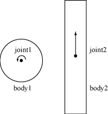

# Joints

[About](#about) 
[Joint Definition](#jd) 
[Joint Factory](#jf) 
[Using Joints](#uj) 

<a name="about">

## About

Joints are used to constrain bodies to the world or to each other. Typical
examples in games include ragdolls, teeters, and pulleys. Joints can be
combined in many different ways to create interesting motions.

Some joints provide limits so you can control the range of motion. Some joint
provide motors which can be used to drive the joint at a prescribed speed
until a prescribed force/torque is exceeded.

Joint motors can be used in many ways. You can use motors to control position
by specifying a joint velocity that is proportional to the difference between
the actual and desired position. You can also use motors to simulate joint
friction: set the joint velocity to zero and provide a small, but significant
maximum motor force/torque. Then the motor will attempt to keep the joint from
moving until the load becomes too strong.

<a name="jd">
## Joint Definition

Each joint type has a definition that derives from b2JointDef. All joints are
connected between two different bodies. One body may static. Joints between
static and/or kinematic bodies are allowed, but have no effect and use some
processing time.

You can specify user data for any joint type and you can provide a flag to
prevent the attached bodies from colliding with each other. This is actually
the default behavior and you must set the collideConnected Boolean to allow
collision between to connected bodies.

Many joint definitions require that you provide some geometric data. Often a
joint will be defined by anchor points. These are points fixed in the attached
bodies. LiquidFun requires these points to be specified in local coordinates.
This way the joint can be specified even when the current body transforms
violate the joint constraint --- a common occurrence when a game is saved and
reloaded. Additionally, some joint definitions need to know the default
relative angle between the bodies. This is necessary to constrain rotation
correctly.

Initializing the geometric data can be tedious, so many joints have
initialization functions that use the current body transforms to remove much
of the work. However, these initialization functions should usually only be
used for prototyping. Production code should define the geometry directly.
This will make joint behavior more robust.

The rest of the joint definition data depends on the joint type. We cover
these now.

<a name="jf">
## Joint Factory

Joints are created and destroyed using the world factory methods. This brings
up an old issue:

    Caution

    Don't try to create a joint on the stack or on the heap using new or malloc.  You must create and destroy bodies and joints using the create and destroy methods of the b2World class.

Here's an example of the lifetime of a revolute joint:

&nbsp;&nbsp;&nbsp;`b2RevoluteJointDef jointDef;` 
&nbsp;&nbsp;&nbsp;`jointDef.bodyA = myBodyA;` 
&nbsp;&nbsp;&nbsp;`jointDef.bodyB = myBodyB;` 
&nbsp;&nbsp;&nbsp;`jointDef.anchorPoint = myBodyA->GetCenterPosition();` 
&nbsp;&nbsp;&nbsp;`b2RevoluteJoint* joint =
(b2RevoluteJoint*)myWorld->CreateJoint(&jointDef);` 
&nbsp;&nbsp;&nbsp;`… do stuff …` 
&nbsp;&nbsp;&nbsp;`myWorld->DestroyJoint(joint);` 
&nbsp;&nbsp;&nbsp;`joint = NULL;` 

It is always good to nullify your pointer after they are destroyed. This will
make the program crash in a controlled manner if you try to reuse the pointer.

The lifetime of a joint is not simple. Heed this warning well:

    Caution

    Joints are destroyed when an attached body is destroyed.

This precaution is not always necessary. You may organize your game engine so
that joints are always destroyed before the attached bodies. In this case you
don't need to implement the listener class. See the section on Implicit
Destruction for details.

<a name="uj">
## Using Joints

Many simulations create the joints and don't access them again until they are
destroyed. However, there is a lot of useful data contained in joints that you
can use to create a rich simulation.

First of all, you can get the bodies, anchor points, and user data from a
joint.

&nbsp;&nbsp;&nbsp;`b2Body* GetBodyA();`

&nbsp;&nbsp;&nbsp;`b2Body* GetBodyB();`

&nbsp;&nbsp;&nbsp;`b2Vec2 GetAnchorA();`

&nbsp;&nbsp;&nbsp;`b2Vec2 GetAnchorB();`

&nbsp;&nbsp;&nbsp;`void* GetUserData();`

All joints have a reaction force and torque. This the reaction force applied
to body 2 at the anchor point. You can use reaction forces to break joints or
trigger other game events. These functions may do some computations, so don't
call them if you don't need the result.

&nbsp;&nbsp;&nbsp;`b2Vec2 GetReactionForce();` 

&nbsp;&nbsp;&nbsp;`float32 GetReactionTorque();` 

### Distance Joint

One of the simplest joint is a distance joint which says that the distance
between two points on two bodies must be constant. When you specify a distance
joint the two bodies should already be in place. Then you specify the two
anchor points in world coordinates. The first anchor point is connected to
body 1, and the second anchor point is connected to body 2. These points imply
the length of the distance constraint.

 

Here is an example of a distance joint definition. In this case we decide to
allow the bodies to collide.

&nbsp;&nbsp;&nbsp;`b2DistanceJointDef jointDef;` 
&nbsp;&nbsp;&nbsp;`jointDef.Initialize(myBodyA, myBodyB, worldAnchorOnBodyA,
worldAnchorOnBodyB);` 
&nbsp;&nbsp;&nbsp;`jointDef.collideConnected = true;` 

The distance joint can also be made soft, like a spring-damper connection. See
the Web example in the testbed to see how this behaves.

Softness is achieved by tuning two constants in the definition: frequency and
damping ratio. Think of the frequency as the frequency of a harmonic
oscillator (like a guitar string). The frequency is specified in Hertz.
Typically the frequency should be less than a half the frequency of the time
step. So if you are using a 60Hz time step, the frequency of the distance
joint should be less than 30Hz. The reason is related to the Nyquist frequency.

The damping ratio is non-dimensional and is typically between 0 and 1, but can
be larger. At 1, the damping is critical (all oscillations should vanish).

&nbsp;&nbsp;&nbsp;`jointDef.frequencyHz = 4.0f;` 
&nbsp;&nbsp;&nbsp;`jointDef.dampingRatio = 0.5f;` 

### Revolute Joint

A revolute joint forces two bodies to share a common anchor point, often
called a hinge point. The revolute joint has a single degree of freedom: the
relative rotation of the two bodies. This is called the joint angle.

 

To specify a revolute you need to provide two bodies and a single anchor point
in world space. The initialization function assumes that the bodies are
already in the correct position.

In this example, two bodies are connected by a revolute joint at the first
body's center of mass.

&nbsp;&nbsp;&nbsp;`b2RevoluteJointDef jointDef;` 
&nbsp;&nbsp;&nbsp;`jointDef.Initialize(myBodyA, myBodyB,
myBodyA->GetWorldCenter());` 

The revolute joint angle is positive when bodyB rotates CCW about the angle
point. Like all angles in LiquidFun, the revolute angle is measured in
radians. By convention the revolute joint angle is zero when the joint is
created using Initialize(), regardless of the current rotation of the two
bodies.

In some cases you might wish to control the joint angle. For this, the
revolute joint can optionally simulate a joint limit and/or a motor.

A joint limit forces the joint angle to remain between a lower and upper
bound. The limit will apply as much torque as needed to make this happen. The
limit range should include zero, otherwise the joint will lurch when the
simulation begins.

A joint motor allows you to specify the joint speed (the time derivative of
the angle). The speed can be negative or positive. A motor can have infinite
force, but this is usually not desirable. Recall the eternal question:

*"What happens when an irresistible force meets an immovable object?"*

I can tell you it's not pretty. So you can provide a maximum torque for the
joint motor. The joint motor will maintain the specified speed unless the
required torque exceeds the specified maximum. When the maximum torque is
exceeded, the joint will slow down and can even reverse.

You can use a joint motor to simulate joint friction. Just set the joint speed
to zero, and set the maximum torque to some small, but significant value. The
motor will try to prevent the joint from rotating, but will yield to a
significant load.

Here's a revision of the revolute joint definition above; this time the joint
has a limit and a motor enabled. The motor is setup to simulate joint friction.

b2RevoluteJointDef jointDef;
jointDef.Initialize(bodyA, bodyB, myBodyA->GetWorldCenter());
jointDef.lowerAngle = -0.5f * b2_pi; // -90 degrees
jointDef.upperAngle = 0.25f * b2_pi; // 45 degrees
jointDef.enableLimit = true;
jointDef.maxMotorTorque = 10.0f;
jointDef.motorSpeed = 0.0f;
jointDef.enableMotor = true;

You can access a revolute joint's angle, speed, and motor torque.

&nbsp;&nbsp;&nbsp;`float32 GetJointAngle() const;` 
&nbsp;&nbsp;&nbsp;`float32 GetJointSpeed() const;` 
&nbsp;&nbsp;&nbsp;`float32 GetMotorTorque() const;` 

You also update the motor parameters each step.

&nbsp;&nbsp;&nbsp;`void SetMotorSpeed(float32 speed);` 
&nbsp;&nbsp;&nbsp;`void SetMaxMotorTorque(float32 torque);` 

Joint motors have some interesting abilities. You can update the joint speed
every time step so you can make the joint move back-and-forth like a sine-wave
or according to whatever function you want.

&nbsp;&nbsp;&nbsp;`... Game Loop Begin ...` 
&nbsp;&nbsp;&nbsp;`myJoint->SetMotorSpeed(cosf(0.5f * time));` 
&nbsp;&nbsp;&nbsp;`... Game Loop End ...` 

You can also use joint motors to track a desired joint angle. For example:

&nbsp;&nbsp;&nbsp;`... Game Loop Begin ...` 
&nbsp;&nbsp;&nbsp;`float32 angleError = myJoint->GetJointAngle() -
angleTarget;` 
&nbsp;&nbsp;&nbsp;`float32 gain = 0.1f;` 
&nbsp;&nbsp;&nbsp;`myJoint->SetMotorSpeed(-gain * angleError);` 
&nbsp;&nbsp;&nbsp;`... Game Loop End ...` 

Generally your gain parameter should not be too large. Otherwise your joint
may become unstable.

### Prismatic Joint

A prismatic joint allows for relative translation of two bodies along a
specified axis. A prismatic joint prevents relative rotation. Therefore, a
prismatic joint has a single degree of freedom.

 

The prismatic joint definition is similar to the revolute joint description;
just substitute translation for angle and force for torque. Using this analogy
provides an example prismatic joint definition with a joint limit and a
friction motor:

&nbsp;&nbsp;&nbsp;`b2PrismaticJointDef jointDef;` 
&nbsp;&nbsp;&nbsp;`b2Vec2 worldAxis(1.0f, 0.0f);` 
&nbsp;&nbsp;&nbsp;`jointDef.Initialize(myBodyA, myBodyB,
myBodyA->GetWorldCenter(), worldAxis);` 
&nbsp;&nbsp;&nbsp;`jointDef.lowerTranslation = -5.0f;` 
&nbsp;&nbsp;&nbsp;`jointDef.upperTranslation = 2.5f;` 
&nbsp;&nbsp;&nbsp;`jointDef.enableLimit = true;` 
&nbsp;&nbsp;&nbsp;`jointDef.maxMotorForce = 1.0f;` 
&nbsp;&nbsp;&nbsp;`jointDef.motorSpeed = 0.0f;` 
&nbsp;&nbsp;&nbsp;`jointDef.enableMotor = true;` 

The revolute joint has an implicit axis coming out of the screen. The
prismatic joint needs an explicit axis parallel to the screen. This axis is
fixed in the two bodies and follows their motion.

Like the revolute joint, the prismatic joint translation is zero when the
joint is created using Initialize(). So be sure zero is between your lower and
upper translation limits.

Using a prismatic joint is similar to using a revolute joint. Here are the
relevant member functions:

&nbsp;&nbsp;&nbsp;`float32 GetJointTranslation() const;`

&nbsp;&nbsp;&nbsp;`float32 GetJointSpeed() const;`

&nbsp;&nbsp;&nbsp;`float32 GetMotorForce() const;`

&nbsp;&nbsp;&nbsp;`void SetMotorSpeed(float32 speed);`

&nbsp;&nbsp;&nbsp;`void SetMotorForce(float32 force);`

### Pulley Joint

A pulley is used to create an idealized pulley. The pulley connects two bodies
to ground and to each other. As one body goes up, the other goes down. The
total length of the pulley rope is conserved according to the initial
configuration.

length1 + length2 == constant

You can supply a ratio that simulates a block and tackle. This causes one side
of the pulley to extend faster than the other. At the same time the constraint
force is smaller on one side than the other. You can use this to create
mechanical leverage.

length1 + ratio * length2 == constant

For example, if the ratio is 2, then length1 will vary at twice the rate of
length2. Also the force in the rope attached to body1 will have half the
constraint force as the rope attached to body2.

 

Pulleys can be troublesome when one side is fully extended. The rope on the
other side will have zero length. At this point the constraint equations
become singular (bad). You should configure collision shapes to prevent this.

Here is an example pulley definition:

&nbsp;&nbsp;&nbsp;`b2Vec2 anchor1 = myBody1->GetWorldCenter();` 
&nbsp;&nbsp;&nbsp;`b2Vec2 anchor2 = myBody2->GetWorldCenter();` 
&nbsp;&nbsp;&nbsp;`b2Vec2 groundAnchor1(p1.x, p1.y + 10.0f);` 
&nbsp;&nbsp;&nbsp;`b2Vec2 groundAnchor2(p2.x, p2.y + 12.0f);` 
&nbsp;&nbsp;&nbsp;`float32 ratio = 1.0f;` 
&nbsp;&nbsp;&nbsp;`b2PulleyJointDef jointDef;` 
&nbsp;&nbsp;&nbsp;`jointDef.Initialize(myBody1, myBody2, groundAnchor1,
groundAnchor2, anchor1, anchor2, ratio);` 

Pulley joints provide the current lengths.

&nbsp;&nbsp;&nbsp;`float32 GetLengthA() const;` 
&nbsp;&nbsp;&nbsp;`float32 GetLengthB() const;` 

### Gear Joint

If you want to create a sophisticated mechanical contraption you might want to
use gears. In principle you can create gears in LiquidFun by using compound
shapes to model gear teeth. This is not very efficient and might be tedious to
author. You also have to be careful to line up the gears so the teeth mesh
smoothly. LiquidFun has a simpler method of creating gears:  the gear joint.

 

The gear joint can only connect revolute and/or prismatic joints.

Like the pulley ratio, you can specify a gear ratio. However, in this case the
gear ratio can be negative. Also keep in mind that when one joint is a
revolute joint (angular) and the other joint is prismatic (translation), and
then the gear ratio will have units of length or one over length.

coordinate1 + ratio * coordinate2 == constant

Here is an example gear joint. The bodies myBodyA and myBodyB are any bodies
from the two joints, as long as they are not the same bodies.

&nbsp;&nbsp;&nbsp;`b2GearJointDef jointDef;` 
&nbsp;&nbsp;&nbsp;`jointDef.bodyA = myBodyA;` 
&nbsp;&nbsp;&nbsp;`jointDef.bodyB = myBodyB;` 
&nbsp;&nbsp;&nbsp;`jointDef.joint1 = myRevoluteJoint;` 
&nbsp;&nbsp;&nbsp;`jointDef.joint2 = myPrismaticJoint;` 
&nbsp;&nbsp;&nbsp;`jointDef.ratio = 2.0f * b2_pi / myLength;` 

Note that the gear joint depends on two other joints. This creates a fragile
situation. What happens if those joints are deleted?

    Caution

    Always delete gear joints before the revolute/prismatic joints on the gears. Otherwise your code will crash in a bad way due to the orphaned joint pointers in the gear joint. You should also delete the gear joint before you delete any of the bodies involved.

### Mouse Joint

The mouse joint is used in the testbed to manipulate bodies with the mouse. It
attempts to drive a point on a body towards the current position of the
cursor. There is no restriction on rotation.

The mouse joint definition has a target point, maximum force, frequency, and
damping ratio. The target point initially coincides with the body’s anchor
point. The maximum force is used to prevent violent reactions when multiple
dynamic bodies interact. You can make this as large as you like. The frequency
and damping ratio are used to create a spring/damper effect similar to the
distance joint.

 Many users have tried to adapt the mouse joint for game play. Users often
want to achieve precise positioning and instantaneous response. The mouse
joint doesn’t work very well in that context. You may wish to consider using
kinematic bodies instead.

### Wheel Joint

The wheel joint restricts a point on bodyB to a line on bodyA. The wheel joint
also provides a suspension spring. See b2WheelJoint.h and Car.h for details.

 

### Weld Joint

The weld joint attempts to constrain all relative motion between two bodies.
See the Cantilever.h in the testbed to see how the weld joint behaves.

It is tempting to use the weld joint to define breakable structures. However,
the LiquidFun solver is iterative so the joints are a bit soft. So chains of
bodies connected by weld joints will flex.

Instead it is better to create breakable bodies starting with a single body
with multiple fixtures. When the body breaks, you can destroy a fixture and
recreate it on a new body. See the Breakable example in the testbed.

### Rope Joint

The rope joint restricts the maximum distance between two points. This can be
useful to prevent chains of bodies from stretching, even under high load. See
b2RopeJoint.h and RopeJoint.h for details.

### Friction Joint

The friction joint is used for top-down friction. The joint provides 2D
translational friction and angular friction. See b2FrictionJoint.h and
ApplyForce.h for details.

*This content is licensed under
[Creative Commons Attribution 4.0](http://creativecommons.org/licenses/by/4.0/legalcode).
For details and restrictions, please see the
[Content License](md__content_license.html).*
