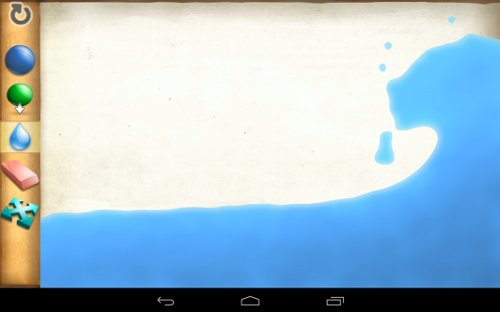

# Getting Started with Java and LiquidFun

This document describes how to set up a Java project to use LiquidFun. It
has the following sections:
*   [Overview](#Overview)
*   [Installation](#Installation): How to install [SWIG][].
*   [Build Instructions](#BuildInstructions): How to include LiquidFun JNI in
    your project.
*   [Sample](#Sample): A Java program that uses LiquidFun's SWIG bindings.
*   [Programmer's Guide](#ProgrammersGuide): A discussion on how this differs
    from using LiquidFun in native C++ code.

### Overview

A subset of the LiquidFun API has been exposed to Java via [SWIG][] bindings.
The [SWIG][] interface files have the .swig extension.
They are located in `Box2D/swig/java`. For convenience, the file structure
mirrors the file structure of Box2D.

Some LiquidFun header files are not pulled directly into SWIG. This allows
users to pull in only the functionality they need. This, in turn, reduces the
number of JNI bindings produced.

### Installation

Current [SWIG][] version tested: 2.0.11

To learn more about SWIG, and to install it, please visit their
[website](http://www.swig.org).

On Linux, you also must install PCRE, as SWIG depends on it: 

&nbsp;&nbsp;&nbsp;`apt-get install libpcre3-dev`

Set up an environment variable to point to your SWIG installation.
One way to do this (on Linux, OSX, or Cygwin) is to add the following to your
`~/.bashrc` file: 

&nbsp;&nbsp;&nbsp;`export SWIG_BIN=$("which" swig)`

### Build Instructions

#### Using LiquidFun JNI in your Eclipse Android project

Include the library in your `jni/Android.mk` file as a shared library:

        LOCAL_SHARED_LIBRARIES := libliquidfun_jni
        include $(BUILD_SHARED_LIBRARY)
        $(call import-add-path,/path/to/liquidfun/)
        $(call import-module,Box2D/swig/jni)

This will invoke SWIG, and build the C++ components of the library.

Next, launch Eclipse, and perform the following steps:

1. Right-click project > Properties.
2. Click on "Java Build Path" on the left panel.
3. In the Source tab, click "Link Source..."
4. Browse to the `Box2D/swig/gen` folder, and give it a name.

You should now be able to build and run your application using LiquidFun. All
generated Java files reside in `Liquidfun/Box2D/swig/gen`. You can refer to
these files to confirm class, method, and other names.

**Caution**

LiquidFun JNI uses the SWIG director feature, which can introduce the following
compiler error:

`error: dereferencing type-punned pointer will break strict-aliasing rules`
`[-Werror=strict-aliasing]`

To ensure a successful build, you will need to disable strict-aliasing in your
makefile. For an Android project, add `-fno-strict-aliasing` to your
`Application.mk` file.

### Sample

The open source app [LiquidFun Paint][] is written in Java, and uses LiquidFun
via SWIG bindings.

### Programmer's Guide

The LiquidFun SWIG interface files pull in a subset of the LiquidFun API,
extends it, and presents it in a way consistent with typical Java style.

#### Function and Variable Renames

*   All b2 class name prefixes have been removed.
*   All function names have been converted to mixedCase.
*   All m_ member variable prefixes have been removed.
*   All b2 enum name prefixes have been removed.

#### Memory Management

JVM (Java Virtual Machine) uses garbage collection to clean up memory, which
is very different from the user-managed memory model in C++. The following
points are critical in order to facilitate efficient JNI memory management.

##### Use the delete() method in generated Java classes

The user must use the SWIG-generated delete() method to clean up all LiquidFun
objects exposed through [SWIG][]. This is because
SWIG-generated (Java) proxy classes--not the JVM--are allocating C++ memory
through every new object.

For example:

&nbsp;&nbsp;&nbsp;`BodyDef* bodyDef = new BodyDef();` 
    ... 
&nbsp;&nbsp;&nbsp;``bodyDef.delete();` 

For a member variable that is a native object:

&nbsp;&nbsp;&nbsp;`private World mWorld = new World(0, 0);` 
    ... 
&nbsp;&nbsp;&nbsp;`@Override` 
&nbsp;&nbsp;&nbsp;`protected void finalize() {` 
    &nbsp;&nbsp;&nbsp;`mWorld.delete();` 
&nbsp;&nbsp;&nbsp;`}` 

##### Use primitive types whenever possible

Because the user has to be conscientious about cleaning up any new objects,
directly exposing to Java a C++ function signature like 

&nbsp;&nbsp;&nbsp;`void SetPosition(const b2Vec2& pos);` 

will create this method: 

&nbsp;&nbsp;&nbsp;`void setPosition(Vec2 pos);` 

This method requires that the user creates Vec2 objects. Since Vec2 objects are
native objects, you must clean them up using a delete() method, which can be
quite unwieldy when you are initializing large amounts of data.

Instead, use SWIG to extend the interface. Do this by adding a new function to
the corresponding SWIG interface file: 

&nbsp;&nbsp;&nbsp;`%extend b2ParticleDef {` 
    &nbsp;&nbsp;&nbsp;`void setPosition(float32 x, float32 y) {` 
        &nbsp;&nbsp;&nbsp;`$self->position.Set(x, y);` 
    &nbsp;&nbsp;&nbsp;`}` 
&nbsp;&nbsp;&nbsp;`};` 

This file generates the following Java code: 

    void setPosition(float x, float y);

which allows the user to call the function with primitive types (in this case,
floats) directly.

Starting from [LiquidFun 1.1]
(http://github.com/google/liquidfun/releases/tag/v1.1.0), the existing extended
SWIG methods have been moved to LiquidFun header files. These methods will be
wrapped with the LIQUIDFUN_EXTERNAL_LANGUAGE_API preprocessor. This is so we
could provide users with a unified API regardless of the programming language
they elect to use.

  [SWIG]: http://www.swig.org
  [LiquidFun Paint]: http://google.github.io/LiquidFunPaint

